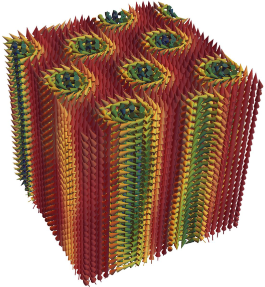
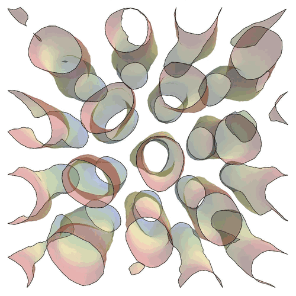

# Sky-MoCa

> Skyrmion - Monte Carlo: Simulated annealing with the Metropolis algorithm for a 3D spin lattice

:warning: **This code was tested with Julia 0.4. Due to breaking changes it does not work with Julia 0.5.x.**



## Physics

We simulate a 3D spin lattice (a three-dimensional unit vector at each lattice site of a three-dimensional lattice) including

* direct exchange (nearest neighbors + next nearest neighbors for anisotropy compensation)
* Dzyaloshinskii-Moriya exchange (nearest neighbors + next nearest neighbors for anisotropy compensation)
* an external field

This setup is suitable to simulate chiral magnets such as MnSi or Fe<sub>1-x</sub>Co<sub>x</sub>Si, see [arxiv:1304.6580](https://arxiv.org/abs/1304.6580).

The only _free parameters_ are the external field B and the temperature T. In this B/T phase space we find the helical, conical and skyrmion phase. We can also simulate the transitions from the skyrmion phase to the conical phase and the unwinding of skyrmion tubes, which is the transition to the helical phase [paper](http://science.sciencemag.org/content/340/6136/1076).



## Dependencies

The following Julia packages are used in the simulation

* `HDF5`
* `StatsBase`
* `ProgressMeter`

For the post processing and visualization we use

* `PyPlot`
* `LsqFit`
* `Images`

There is also an additional Mathematica notebook for more beautiful plots and images.

## Usage

A typical annealing schedule could consist of first cooling from T=1.5 to T=0.7 at fixed external field B=0.16 in steps of 0.1. Then we decrease the external field from B=0.16 to B=0.0 in steps of 0.005. This gives a total of length(Ts)+length(Bs)-1 = 41 stages in the annealing schedule. (This setup can be used to observe the transition in the gif above.)

To this end we simply execute all cells in the first section of the notebook (only function definitions) and then do

```julia
Ts = 1.5:-0.1:0.7
Bs = 0.16:-0.005:0.0
stages = length(Ts)+length(Bs)-1
```

We want to thermalize just once in the very beginning for 10,000 Monte Carlo steps.

```julia
therm = vcat(10000, zeros(Int64, stages-1))
```

We take 30 sweeps between two subsequent configurations for all stages.

```julia
sweeps = fill(30, stages)
```

We average over 2000 configurations during cooling and 1000 configurations afterwards.

```julia
configs = vcat(fill(2000, length(Ts)), fill(1000, length(Bs)-1))
```

Now we can setup the global parameters on a 30<sup>3</sup> grid with open boundaries in the z direction (boundaries in the x and y direction are always periodic)

```julia
anneal = Schedule(Ts, Bs, therm, sweeps, configs)
pars = Parameters(anneal, Nx=42, Ny=42, Nz=30, openbnd=true, denseoutput=false)
mon, res = init(anneal)
```

:fire: Fire it up! :fire:

```julia
run("output", anneal)
```
